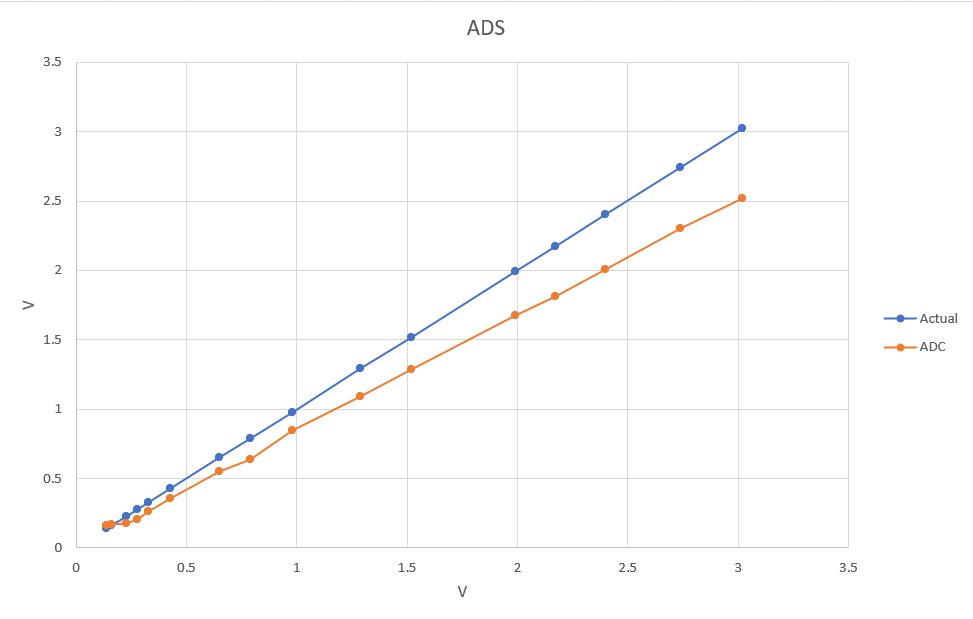

# MyEIT-V1.1
Electrical Impedance Tomography using ESP32 S2 microcontroller with MicroPython - V1.1

Based on [my previous project](https://github.com/RonAaron61/EIT-Microcontroller)

---

## List of content

- [Abstract](#Absract)
- [Introduction](#Instroduction)
- [Design](#Design)
- [Component](#Component)
- [Programs](#Programs)
- [Result](#Result)

---

## Abstract

abstract

---

## Introduction

Electrical impedance tomography (EIT) is a non-invasive, radiation-free medical imaging technique. It's used to image the electrical impedance variations inside a volume of interest. In this project, I made an EIT using an ESP32-S2 microcontroller, and the EIT that was made had a total of 16 electrodes. One of the goals of this project is to create an EIT that is cheap and easy to create and use.

Previously I had made the same EIT device, this model is an improvement based on the previous. A couple of changes were the adding buffer and resistor value changes in VCCS, positive to negative voltage is now using TPS60400, Some DIP components changed to SMD components for simplicity and more compact size, adding the calibration equation to the ADS1115

---

## Design

The Electrical Impedance Tomography (EIT) that is made consists of several components such as the AD9833 module, amplifier, High Pass Filter, instrument amplifier, VCCS, multi/demultiplexer, AC DC converter, ADC, and of course, the microcontroller which uses the ESP32-S2

</img>

---

## Components

### VCCS

The function of VCCS is to get current sources that can be controlled using the input voltage, so the current doesn't exceed some limit. The VCCS that I used is the Discrete Improved Howland Current Pump With Buffer, based on

> [Creegan A. et al., (2024) A Wearable Open-Source electrical impedance tomography device](https://doi.org/10.1016/j.ohx.2024.e00521)

> [Ignacio V. L., Analysis of Improved Howland Current Pump Configurations](https://www.ti.com/lit/an/sboa437a/sboa437a.pdf?.)

</img>

Where:

$I_{VCCSOut} = \frac {A_{Howland} \times (V_p - V_n)} {R_S}$

$A_{Howland} = \frac {R2}{R1}$, given R1 = R3 and R2 = R4

Because R1 = R2 = R3 = R4 = 10KΩ, $A_{Howland} = 1$ , and $V_n = 0$

$I_{VCCSOut} = \frac {V_p} {R_S} = \frac {V_p} {1000}$

So, if using the same voltage as the previous version,

$I_{VCCSOut} = \frac {500mV} {1000} = 0.5mA$

When tested using 0.32 Vrms at 40kHz the current was stable at average around 0.34 mA from 55Ω up to 7 kΩ

</img>

### Instrument Amplifier

The instrument amplifier functions as an amplifier from two different signal inputs. For the instrument amplifier (IA), I use AD620 IC. One IA is connected to a reference resistor from VCCS, and the other one is placed at the observed object with the same gain value. The gain equation is:

$$ G = {49.4 kΩ \over RG} + 1 $$

</img>

On the second IA, there's also a High Pass Filter because the signal from the human body will also contain a noise such as Power Line Noise, so we will remove it using a High Pass Filter, I use first-order HPF with a 740 Hz cut-off frequency, with 1 uF capacitor and 220 Ω (215 tested on the multimeter). I first used 1 kΩ (Fc = 159 Hz) but the noise was still present so I tried higher Fc.

### Positive to negative Converter

Previous using a voltage divider, but required 2 times the voltage needed, which is 10V

TPS60400 convert positive voltage from 1.6V to 5.5V into -1.6V to -5.5V

</img>

only required three 1uF capacitor

with an output maximum of only 60mA, still above the maximum current of the circuit, in which the negative voltage only gets used by 3 IC (2 OPA2134PA & 1 AD620)

- OPA2134PA estimated current -> ±10mA per channel -> 40 mA total
- AD620 estimated current -> ±1.6 mA max supply current
  
This is already being tested in pref board with 2 OPA2134PA and AD620 to simulate a non-inverting amplifier, VCCS + buffer, instrumental amplify with AD620, and buffer (to simulate AC to DC), and all IC run fine

### ADS1115

For the ADC I don't use the Microcontroller ADC but I use a module, I use the ADS1115 16bit ADC module 

</img>

### Multi/Demultiplexer

Multi/Demultiplexer used is CD74HC4067 ICs which is a 16 channel multiplexer and demultiplexer

### ESP32-S2 (Wemos S2 mini)

 

For the microcontroller, I use Wemos S2 Mini, a mini wifi boards based ESP32-S2FN4R2. The reason I use this board is because of the compact size and it has lot of GPIO pin to use, because to drive the multi/demultiplexer I need at least 16 IO pins, then 2 pins for SDA/SCL, and 3 SPI connections

---

## Result

### PCB

</img>

</img>

*Note that in the image I use one CA324DE IC to replace one of the OPA2134PA ICs that I don't currently have. But using the IC also works fine

### Peak-detector calibration

The peak-detector not working smoothly and reduces the voltage by around 17%, which needs to be re-calibrate on the ADC

</img>

with, $voltage = voltage + (voltage* 17/100)$

### Reconstructed image

### Electrode Housing

test

### Thorax

Attempt to try to reconstruct the thorax area using 16 electrodes attached using disposable ECG Electrode with pre-gelled AG/AGCL sensor placed around the thorax area bellow nipple

</img>

The experiment starts with first collecting 10 data and averaging them to be used as the reference data, after that the actual data is then collected and reconstructed using JAC (One-step Gauss-Newton) method. The signal injected was using a 40kHz sine wave at around 0.4 mA. Based on the result, the data collected fluctuates, especially when the subject is moving. However, when the data collected is in good numbers, the data can be reconstructed resulting in two objects in the middle of the image, which are assumed to be lungs.

An example of the image when the data was good and the subject was not moving,

</img>

and most of the time the data is very fluctuating resulting in a higher number than it should be, 

</img>

another example when the data is in the good numbers,

https://github.com/RonAaron61/MyEIT-V1.1/assets/105662575/0e5fefc8-61db-4f4e-9c7e-a2b2d6b81bc3

as for now, it is not clear what caused this, as I'm not able to analyze the data because my Oscilloscope is currently not accessible

---

## Problems

There are a couple of problems that encountered during the making of this project,

- The ADS1115 ADC somehow can't read voltage lower than ±0.24V -> in the next version add a buffer after the output of AD620 and filter around 0.45V using a voltage divider then read it on channel A0, then compare to A1 which is connected to the same voltage divider as the reference voltage
